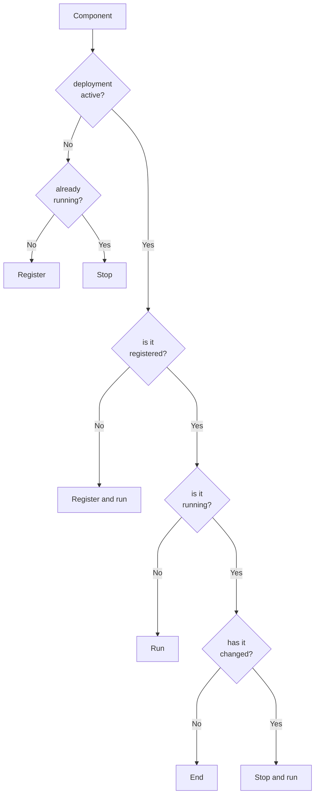

```mermaid
flowchart TD
    A[Component] --> B{deployment\nactive?}
    B -- No --> C{already\nrunning?}
    C -- No --> D[Register]
    C -- Yes --> E[Stop]
    B -- Yes ----> F{is it\nregistered?}
    F -- No ----> G[Register and run]
    F -- Yes ----> H{is it\nrunning?}
    H -- No ----> I[Run]
    H -- Yes ----> J{has it\nchanged?}
    J -- No ----> K[End]
    J -- Yes ----> L[Stop and run]
    
```