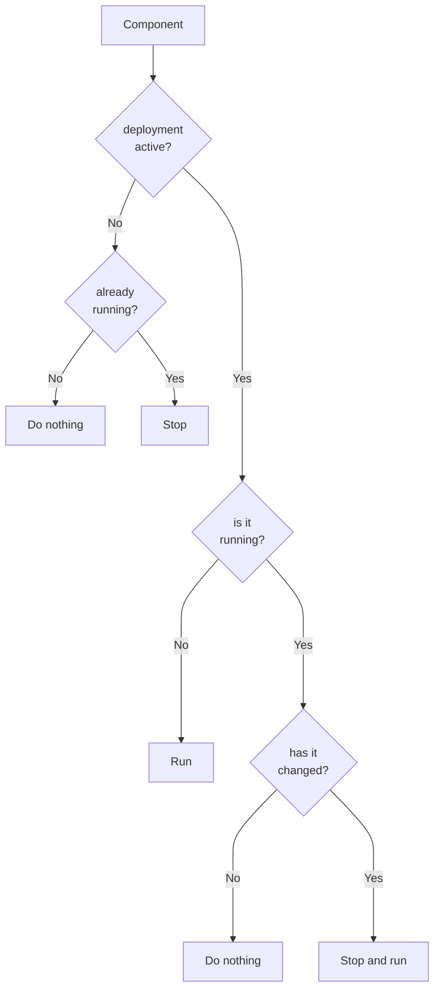

```mermaid
flowchart TD
    A1[Component] --> B1{deployment\nactive?}
    B1 -- No --> C1{already\nrunning?}
    C1 -- No --> D1[Do nothing]
    C1 -- Yes --> E1[Stop]
    B1 -- Yes ----> H1{is it\nrunning?}
    H1 -- No ----> I1[Run]
    H1 -- Yes ----> J1{has it\nchanged?}
    J1 -- No ----> K1[Do nothing]
    J1 -- Yes ----> L1[Stop and run]
```